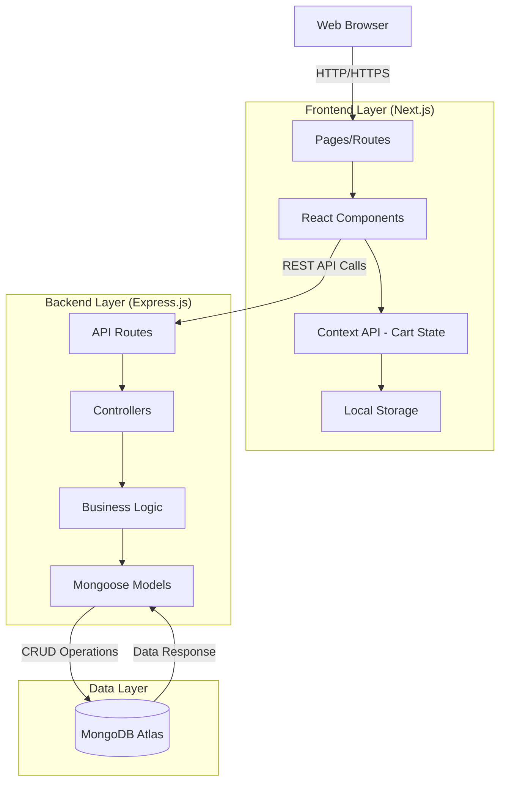

# E-Commerce Website - Technical Architecture Document

## Table of Contents
1. [System Overview](#system-overview)
2. [Technology Stack](#technology-stack)
3. [Architecture Diagram](#architecture-diagram)
4. [Frontend Architecture](#frontend-architecture)
5. [Backend Architecture](#backend-architecture)
6. [Data Models](#data-models)
7. [Project Folder Structure](#project-folder-structure)
8. [State Management Strategy](#state-management-strategy)
9. [API Communication Flow](#api-communication-flow)
10. [Deployment Strategy](#deployment-strategy)

---

## System Overview

This E-Commerce platform is built as a full-stack web application with a clear separation between frontend and backend services. The system follows a client-server architecture pattern with RESTful API communication.

### Key Features
- **Product Browsing**: Dynamic product listing with filtering capabilities
- **Product Details**: Comprehensive product information display
- **Shopping Cart**: Persistent cart management with local storage synchronization

### Architecture Pattern
- **Frontend**: Single Page Application (SPA) using Next.js with server-side rendering capabilities
- **Backend**: RESTful API server using Node.js/Express
- **Database**: NoSQL database (MongoDB Atlas) for flexible product catalog management
- **Communication**: JSON-based HTTP/HTTPS requests

---

## Technology Stack

### Frontend
- **Framework**: Next.js 16.0.1 (React 19.2.0)
- **Language**: TypeScript 5.x
- **Styling**: Tailwind CSS 4.x
- **Routing**: Next.js App Router (built-in)
- **State Management**: React Context API + Local Storage
- **HTTP Client**: Native Fetch API / Axios
- **Build Tool**: Next.js built-in compiler

### Backend
- **Runtime**: Node.js (v18+ recommended)
- **Framework**: Express.js 4.x
- **Language**: TypeScript
- **ODM**: Mongoose 8.x
- **Validation**: Express-validator
- **CORS**: CORS middleware
- **Environment**: dotenv

### Database
- **Database**: MongoDB Atlas (Cloud-hosted)
- **Schema Design**: Mongoose ODM

### Development Tools
- **Version Control**: Git
- **Package Manager**: npm
- **Linting**: ESLint
- **API Testing**: Postman / Thunder Client

---

## Architecture Diagram



### System Flow Description

1. **Client Request**: User interacts with the web application through their browser
2. **Frontend Processing**: Next.js handles routing, React components render the UI
3. **State Management**: Shopping cart state managed via Context API and persisted in Local Storage
4. **API Communication**: Frontend makes RESTful API calls to the Express backend
5. **Backend Processing**: Express routes handle requests, controllers process business logic
6. **Data Layer**: Mongoose models interact with MongoDB Atlas for data persistence
7. **Response Flow**: Data flows back through the same chain to update the UI

---

## Frontend Architecture

### Key React Components

#### 1. **Layout Components**

**`components/layout/Navbar.tsx`**
- **Responsibility**: Main navigation bar with logo, search, and cart icon
- **Props**: `cartItemCount: number`
- **Features**:
  - Logo and brand name
  - Navigation links (Home, Products, Categories)
  - Shopping cart icon with badge showing item count
  - Responsive mobile menu

**`components/layout/Footer.tsx`**
- **Responsibility**: Site footer with links and information
- **Features**: Copyright, social links, customer service links

#### 2. **Product Components**

**`components/products/ProductList.tsx`**
- **Responsibility**: Display grid/list of all products
- **Props**: None (fetches data internally)
- **State**:
  - `products: Product[]`
  - `loading: boolean`
  - `error: string | null`
- **Features**:
  - Product grid layout (responsive)
  - Loading skeleton
  - Error handling
  - Empty state message
- **API Calls**: `GET /api/products`

**`components/products/ProductCard.tsx`**
- **Responsibility**: Individual product card in the list
- **Props**: `product: Product`
- **Features**:
  - Product image
  - Product name, price, rating
  - "Add to Cart" button
  - Click to view details
- **Events**: `onClick` navigates to product detail page

**`components/products/ProductDetail.tsx`**
- **Responsibility**: Detailed product information page
- **Props**: `productId: string` (from route params)
- **State**:
  - `product: Product | null`
  - `selectedQuantity: number`
  - `loading: boolean`
- **Features**:
  - Large product image gallery
  - Detailed description
  - Price and availability
  - Quantity selector
  - "Add to Cart" with quantity
- **API Calls**: `GET /api/products/:id`

#### 3. **Shopping Cart Components**

**`components/cart/ShoppingCart.tsx`**
- **Responsibility**: Main shopping cart view (modal or page)
- **Props**: None (uses cart context)
- **Features**:
  - List of cart items
  - Subtotal, tax, total calculation
  - "Proceed to Checkout" button
  - Empty cart message
- **Context**: Consumes `CartContext`

**`components/cart/CartItem.tsx`**
- **Responsibility**: Individual item in the cart
- **Props**: `item: CartItem`
- **Features**:
  - Product thumbnail
  - Name, price, quantity
  - Quantity increment/decrement buttons
  - Remove item button
- **Events**: Calls context methods to update/remove items

**`components/cart/CartSummary.tsx`**
- **Responsibility**: Price breakdown summary
- **Props**: `items: CartItem[]`
- **Features**:
  - Subtotal calculation
  - Tax estimation (optional)
  - Total price display

#### 4. **Common/Shared Components**

**`components/common/Button.tsx`**
- **Responsibility**: Reusable button component
- **Props**: `variant, size, onClick, children, disabled, loading`

**`components/common/Input.tsx`**
- **Responsibility**: Reusable input field
- **Props**: `type, value, onChange, placeholder, error`

**`components/common/LoadingSpinner.tsx`**
- **Responsibility**: Loading indicator
- **Props**: `size: 'sm' | 'md' | 'lg'`

**`components/common/ErrorMessage.tsx`**
- **Responsibility**: Error display component
- **Props**: `message: string, onRetry?: () => void`

### Pages Structure (Next.js App Router)

**`app/page.tsx`**
- **Route**: `/`
- **Component**: Home page with featured products

**`app/products/page.tsx`**
- **Route**: `/products`
- **Component**: ProductList component

**`app/products/[id]/page.tsx`**
- **Route**: `/products/:id`
- **Component**: ProductDetail component

**`app/cart/page.tsx`**
- **Route**: `/cart`
- **Component**: ShoppingCart component

**`app/layout.tsx`**
- **Component**: Root layout with Navbar and Footer

---

## Backend Architecture

### API Endpoints

#### Product Endpoints

##### 1. Get All Products
```
GET /api/products
```
- **Purpose**: Retrieve list of all products
- **Query Parameters**:
  - `page` (optional): Page number for pagination (default: 1)
  - `limit` (optional): Items per page (default: 20)
  - `category` (optional): Filter by category
  - `sort` (optional): Sort field (price, name, createdAt)
  - `order` (optional): Sort order (asc, desc)
- **Response**: `200 OK`
```json
{
  "success": true,
  "data": [
    {
      "_id": "507f1f77bcf86cd799439011",
      "name": "Wireless Headphones",
      "description": "High-quality wireless headphones",
      "price": 99.99,
      "category": "Electronics",
      "imageUrl": "https://example.com/image.jpg",
      "stock": 50,
      "rating": 4.5,
      "createdAt": "2025-01-01T00:00:00.000Z"
    }
  ],
  "pagination": {
    "currentPage": 1,
    "totalPages": 5,
    "totalItems": 100
  }
}
```

##### 2. Get Product by ID
```
GET /api/products/:id
```
- **Purpose**: Retrieve detailed information for a specific product
- **URL Parameters**:
  - `id`: MongoDB ObjectId of the product
- **Response**: `200 OK`
```json
{
  "success": true,
  "data": {
    "_id": "507f1f77bcf86cd799439011",
    "name": "Wireless Headphones",
    "description": "High-quality wireless headphones with noise cancellation",
    "price": 99.99,
    "category": "Electronics",
    "imageUrl": "https://example.com/image.jpg",
    "images": [
      "https://example.com/image1.jpg",
      "https://example.com/image2.jpg"
    ],
    "stock": 50,
    "rating": 4.5,
    "reviews": [],
    "specifications": {
      "brand": "TechBrand",
      "color": "Black",
      "weight": "250g"
    },
    "createdAt": "2025-01-01T00:00:00.000Z",
    "updatedAt": "2025-01-10T00:00:00.000Z"
  }
}
```
- **Error Response**: `404 Not Found`
```json
{
  "success": false,
  "message": "Product not found"
}
```

##### 3. Create Product (Admin)
```
POST /api/products
```
- **Purpose**: Add a new product to the catalog
- **Authentication**: Required (Admin only)
- **Request Body**:
```json
{
  "name": "Wireless Headphones",
  "description": "High-quality wireless headphones",
  "price": 99.99,
  "category": "Electronics",
  "imageUrl": "https://example.com/image.jpg",
  "stock": 50
}
```
- **Response**: `201 Created`

##### 4. Update Product (Admin)
```
PUT /api/products/:id
```
- **Purpose**: Update existing product information
- **Authentication**: Required (Admin only)

##### 5. Delete Product (Admin)
```
DELETE /api/products/:id
```
- **Purpose**: Remove a product from the catalog
- **Authentication**: Required (Admin only)

#### Cart Endpoints (Optional - Server-side cart)

##### 6. Get User Cart
```
GET /api/cart
```
- **Purpose**: Retrieve user's cart (if using server-side cart)
- **Authentication**: Optional (user session/token)
- **Response**: `200 OK`
```json
{
  "success": true,
  "data": {
    "items": [
      {
        "productId": "507f1f77bcf86cd799439011",
        "quantity": 2,
        "product": {
          "name": "Wireless Headphones",
          "price": 99.99,
          "imageUrl": "https://example.com/image.jpg"
        }
      }
    ],
    "totalItems": 2,
    "subtotal": 199.98
  }
}
```

### Backend Structure

#### Controllers

**`controllers/productController.ts`**
- `getAllProducts`: Handle product listing with filters
- `getProductById`: Handle single product retrieval
- `createProduct`: Handle product creation
- `updateProduct`: Handle product updates
- `deleteProduct`: Handle product deletion

#### Services

**`services/productService.ts`**
- Business logic layer between controllers and models
- Data validation and transformation
- Error handling

#### Routes

**`routes/productRoutes.ts`**
- Define all product-related routes
- Connect routes to controller methods
- Apply middleware (validation, authentication)

#### Middleware

**`middleware/errorHandler.ts`**
- Centralized error handling
- Format error responses

**`middleware/validator.ts`**
- Request validation using express-validator
- Sanitize inputs

**`middleware/cors.ts`**
- CORS configuration for frontend access

---

## Data Models

### Product Model (Mongoose Schema)

**`models/Product.ts`**

```typescript
import mongoose, { Schema, Document } from 'mongoose';

export interface IProduct extends Document {
  name: string;
  description: string;
  price: number;
  category: string;
  imageUrl: string;
  images?: string[];
  stock: number;
  rating?: number;
  reviews?: IReview[];
  specifications?: Record<string, string>;
  createdAt: Date;
  updatedAt: Date;
}

interface IReview {
  userId: string;
  userName: string;
  rating: number;
  comment: string;
  createdAt: Date;
}

const ProductSchema: Schema = new Schema(
  {
    name: {
      type: String,
      required: [true, 'Product name is required'],
      trim: true,
      maxlength: [200, 'Name cannot exceed 200 characters']
    },
    description: {
      type: String,
      required: [true, 'Product description is required'],
      trim: true,
      maxlength: [2000, 'Description cannot exceed 2000 characters']
    },
    price: {
      type: Number,
      required: [true, 'Product price is required'],
      min: [0, 'Price cannot be negative'],
      validate: {
        validator: function(v: number) {
          return /^\d+(\.\d{1,2})?$/.test(v.toString());
        },
        message: 'Price must have at most 2 decimal places'
      }
    },
    category: {
      type: String,
      required: [true, 'Product category is required'],
      enum: ['Electronics', 'Clothing', 'Books', 'Home', 'Sports', 'Other'],
      default: 'Other'
    },
    imageUrl: {
      type: String,
      required: [true, 'Product image URL is required'],
      validate: {
        validator: function(v: string) {
          return /^https?:\/\/.+/.test(v);
        },
        message: 'Please provide a valid URL'
      }
    },
    images: {
      type: [String],
      default: []
    },
    stock: {
      type: Number,
      required: [true, 'Stock quantity is required'],
      min: [0, 'Stock cannot be negative'],
      default: 0
    },
    rating: {
      type: Number,
      min: 0,
      max: 5,
      default: 0
    },
    reviews: {
      type: [
        {
          userId: { type: String, required: true },
          userName: { type: String, required: true },
          rating: { type: Number, required: true, min: 1, max: 5 },
          comment: { type: String, maxlength: 500 },
          createdAt: { type: Date, default: Date.now }
        }
      ],
      default: []
    },
    specifications: {
      type: Map,
      of: String,
      default: {}
    }
  },
  {
    timestamps: true,
    toJSON: { virtuals: true },
    toObject: { virtuals: true }
  }
);

// Indexes for better query performance
ProductSchema.index({ category: 1 });
ProductSchema.index({ price: 1 });
ProductSchema.index({ name: 'text', description: 'text' });

// Virtual for availability status
ProductSchema.virtual('inStock').get(function() {
  return this.stock > 0;
});

export default mongoose.model<IProduct>('Product', ProductSchema);
```

### Cart Model (Client-side - TypeScript Interface)

**`types/cart.ts`** (Frontend)

```typescript
export interface CartItem {
  productId: string;
  name: string;
  price: number;
  quantity: number;
  imageUrl: string;
  maxStock: number;
}

export interface Cart {
  items: CartItem[];
  totalItems: number;
  subtotal: number;
}

export interface CartContextType {
  cart: Cart;
  addToCart: (product: Product, quantity?: number) => void;
  removeFromCart: (productId: string) => void;
  updateQuantity: (productId: string, quantity: number) => void;
  clearCart: () => void;
  getItemCount: () => number;
}
```

### Cart Model (Server-side - Optional)

**`models/Cart.ts`** (Backend - if implementing server-side cart)

```typescript
import mongoose, { Schema, Document } from 'mongoose';

export interface ICartItem {
  productId: mongoose.Types.ObjectId;
  quantity: number;
}

export interface ICart extends Document {
  userId?: string; // Optional for guest users
  sessionId?: string; // For guest users
  items: ICartItem[];
  createdAt: Date;
  updatedAt: Date;
}

const CartItemSchema = new Schema({
  productId: {
    type: Schema.Types.ObjectId,
    ref: 'Product',
    required: true
  },
  quantity: {
    type: Number,
    required: true,
    min: [1, 'Quantity must be at least 1'],
    default: 1
  }
});

const CartSchema: Schema = new Schema(
  {
    userId: {
      type: String,
      sparse: true // Allows null for guest users
    },
    sessionId: {
      type: String,
      sparse: true
    },
    items: {
      type: [CartItemSchema],
      default: []
    }
  },
  {
    timestamps: true
  }
);

// Ensure either userId or sessionId is provided
CartSchema.index({ userId: 1 }, { unique: true, sparse: true });
CartSchema.index({ sessionId: 1 }, { unique: true, sparse: true });

export default mongoose.model<ICart>('Cart', CartSchema);
```

---

## Project Folder Structure

```
ecommerce-monorepo/
├── frontend/                      # Next.js frontend application
│   ├── app/                       # Next.js App Router
│   │   ├── (routes)/             # Route groups
│   │   │   ├── products/
│   │   │   │   ├── page.tsx      # /products - Product list page
│   │   │   │   └── [id]/
│   │   │   │       └── page.tsx  # /products/:id - Product detail
│   │   │   ├── cart/
│   │   │   │   └── page.tsx      # /cart - Shopping cart page
│   │   │   └── page.tsx          # / - Home page
│   │   ├── layout.tsx            # Root layout
│   │   ├── globals.css           # Global styles
│   │   └── not-found.tsx         # 404 page
│   │
│   ├── components/               # React components
│   │   ├── layout/
│   │   │   ├── Navbar.tsx
│   │   │   ├── Footer.tsx
│   │   │   └── Layout.tsx
│   │   ├── products/
│   │   │   ├── ProductList.tsx
│   │   │   ├── ProductCard.tsx
│   │   │   ├── ProductDetail.tsx
│   │   │   └── ProductFilters.tsx
│   │   ├── cart/
│   │   │   ├── ShoppingCart.tsx
│   │   │   ├── CartItem.tsx
│   │   │   ├── CartSummary.tsx
│   │   │   └── CartIcon.tsx
│   │   └── common/
│   │       ├── Button.tsx
│   │       ├── Input.tsx
│   │       ├── LoadingSpinner.tsx
│   │       ├── ErrorMessage.tsx
│   │       └── Card.tsx
│   │
│   ├── context/                  # React Context providers
│   │   ├── CartContext.tsx       # Shopping cart context
│   │   └── ThemeContext.tsx      # Theme context (optional)
│   │
│   ├── hooks/                    # Custom React hooks
│   │   ├── useCart.ts           # Hook to access cart context
│   │   ├── useProducts.ts       # Hook for fetching products
│   │   ├── useLocalStorage.ts   # Hook for local storage
│   │   └── useDebounce.ts       # Debounce hook
│   │
│   ├── lib/                      # Utility libraries
│   │   ├── api.ts               # API client configuration
│   │   ├── constants.ts         # App constants
│   │   └── utils.ts             # Helper functions
│   │
│   ├── types/                    # TypeScript type definitions
│   │   ├── product.ts
│   │   ├── cart.ts
│   │   └── api.ts
│   │
│   ├── public/                   # Static assets
│   │   ├── images/
│   │   ├── icons/
│   │   └── favicon.ico
│   │
│   ├── .env.local               # Environment variables (not committed)
│   ├── .env.example             # Example environment file
│   ├── next.config.ts           # Next.js configuration
│   ├── tsconfig.json            # TypeScript configuration
│   ├── tailwind.config.ts       # Tailwind CSS configuration
│   ├── postcss.config.mjs       # PostCSS configuration
│   ├── package.json
│   └── README.md
│
├── backend/                      # Express.js backend application
│   ├── src/
│   │   ├── config/              # Configuration files
│   │   │   ├── database.ts      # MongoDB connection
│   │   │   ├── env.ts           # Environment variables
│   │   │   └── cors.ts          # CORS configuration
│   │   │
│   │   ├── models/              # Mongoose models
│   │   │   ├── Product.ts
│   │   │   ├── Cart.ts          # Optional
│   │   │   └── index.ts         # Model exports
│   │   │
│   │   ├── controllers/         # Route controllers
│   │   │   ├── productController.ts
│   │   │   ├── cartController.ts
│   │   │   └── index.ts
│   │   │
│   │   ├── services/            # Business logic
│   │   │   ├── productService.ts
│   │   │   ├── cartService.ts
│   │   │   └── index.ts
│   │   │
│   │   ├── routes/              # API routes
│   │   │   ├── productRoutes.ts
│   │   │   ├── cartRoutes.ts
│   │   │   └── index.ts         # Route aggregator
│   │   │
│   │   ├── middleware/          # Express middleware
│   │   │   ├── errorHandler.ts  # Error handling
│   │   │   ├── validator.ts     # Request validation
│   │   │   ├── logger.ts        # Request logging
│   │   │   └── cors.ts          # CORS middleware
│   │   │
│   │   ├── utils/               # Utility functions
│   │   │   ├── helpers.ts
│   │   │   ├── logger.ts
│   │   │   └── constants.ts
│   │   │
│   │   ├── types/               # TypeScript types
│   │   │   ├── express.d.ts
│   │   │   └── models.ts
│   │   │
│   │   ├── app.ts               # Express app setup
│   │   └── server.ts            # Server entry point
│   │
│   ├── tests/                   # Test files
│   │   ├── unit/
│   │   │   ├── services/
│   │   │   └── models/
│   │   └── integration/
│   │       └── api/
│   │
│   ├── .env                     # Environment variables (not committed)
│   ├── .env.example             # Example environment file
│   ├── tsconfig.json            # TypeScript configuration
│   ├── package.json
│   └── README.md
│
├── .gitignore                   # Git ignore file
├── package.json                 # Root package.json (for monorepo scripts)
└── README.md                    # Project documentation
```

### Key Directory Explanations

**Frontend (`frontend/`)**
- `app/`: Next.js 13+ App Router for file-based routing
- `components/`: Reusable React components organized by feature
- `context/`: React Context providers for global state
- `hooks/`: Custom React hooks for reusable logic
- `lib/`: Utility functions and configurations
- `types/`: TypeScript type definitions

**Backend (`backend/`)**
- `src/config/`: Application configuration (DB, environment)
- `src/models/`: Mongoose schemas and models
- `src/controllers/`: Request handlers
- `src/services/`: Business logic layer
- `src/routes/`: API route definitions
- `src/middleware/`: Express middleware functions
- `src/utils/`: Helper functions and constants

---

## State Management Strategy

### Approach: React Context API + Local Storage

**Rationale**:
- **Simplicity**: For cart management, Context API is sufficient (no external dependencies)
- **Performance**: Cart state changes are infrequent, re-render impact is minimal
- **Persistence**: Local Storage ensures cart survives page refreshes
- **Scalability**: Easy to migrate to Redux/Zustand if app grows

### Implementation Details

#### 1. Cart Context Provider

**`context/CartContext.tsx`**

```typescript
import React, { createContext, useContext, useEffect, useState, ReactNode } from 'react';
import { Cart, CartItem, CartContextType } from '@/types/cart';
import { Product } from '@/types/product';

const CartContext = createContext<CartContextType | undefined>(undefined);

const CART_STORAGE_KEY = 'ecommerce_cart';

// Initialize cart from localStorage
const getInitialCart = (): Cart => {
  if (typeof window === 'undefined') {
    return { items: [], totalItems: 0, subtotal: 0 };
  }
  
  try {
    const storedCart = localStorage.getItem(CART_STORAGE_KEY);
    if (storedCart) {
      return JSON.parse(storedCart);
    }
  } catch (error) {
    console.error('Error loading cart from localStorage:', error);
  }
  
  return { items: [], totalItems: 0, subtotal: 0 };
};

export const CartProvider: React.FC<{ children: ReactNode }> = ({ children }) => {
  const [cart, setCart] = useState<Cart>(getInitialCart);

  // Persist cart to localStorage whenever it changes
  useEffect(() => {
    try {
      localStorage.setItem(CART_STORAGE_KEY, JSON.stringify(cart));
    } catch (error) {
      console.error('Error saving cart to localStorage:', error);
    }
  }, [cart]);

  // Calculate totals helper
  const calculateTotals = (items: CartItem[]) => {
    const totalItems = items.reduce((sum, item) => sum + item.quantity, 0);
    const subtotal = items.reduce((sum, item) => sum + item.price * item.quantity, 0);
    return { totalItems, subtotal };
  };

  // Add product to cart
  const addToCart = (product: Product, quantity: number = 1) => {
    setCart((prevCart) => {
      const existingItemIndex = prevCart.items.findIndex(
        (item) => item.productId === product._id
      );

      let updatedItems: CartItem[];

      if (existingItemIndex > -1) {
        // Update quantity of existing item
        updatedItems = [...prevCart.items];
        const newQuantity = updatedItems[existingItemIndex].quantity + quantity;
        const maxStock = product.stock;
        
        updatedItems[existingItemIndex] = {
          ...updatedItems[existingItemIndex],
          quantity: Math.min(newQuantity, maxStock)
        };
      } else {
        // Add new item
        const newItem: CartItem = {
          productId: product._id,
          name: product.name,
          price: product.price,
          quantity: Math.min(quantity, product.stock),
          imageUrl: product.imageUrl,
          maxStock: product.stock
        };
        updatedItems = [...prevCart.items, newItem];
      }

      const totals = calculateTotals(updatedItems);
      return { items: updatedItems, ...totals };
    });
  };

  // Remove product from cart
  const removeFromCart = (productId: string) => {
    setCart((prevCart) => {
      const updatedItems = prevCart.items.filter(
        (item) => item.productId !== productId
      );
      const totals = calculateTotals(updatedItems);
      return { items: updatedItems, ...totals };
    });
  };

  // Update quantity of item in cart
  const updateQuantity = (productId: string, quantity: number) => {
    if (quantity < 1) {
      removeFromCart(productId);
      return;
    }

    setCart((prevCart) => {
      const updatedItems = prevCart.items.map((item) => {
        if (item.productId === productId) {
          return {
            ...item,
            quantity: Math.min(quantity, item.maxStock)
          };
        }
        return item;
      });
      const totals = calculateTotals(updatedItems);
      return { items: updatedItems, ...totals };
    });
  };

  // Clear entire cart
  const clearCart = () => {
    setCart({ items: [], totalItems: 0, subtotal: 0 });
  };

  // Get total item count
  const getItemCount = () => cart.totalItems;

  const value: CartContextType = {
    cart,
    addToCart,
    removeFromCart,
    updateQuantity,
    clearCart,
    getItemCount
  };

  return <CartContext.Provider value={value}>{children}</CartContext.Provider>;
};

// Custom hook to use cart context
export const useCart = () => {
  const context = useContext(CartContext);
  if (context === undefined) {
    throw new Error('useCart must be used within a CartProvider');
  }
  return context;
};
```

#### 2. Integration in Root Layout

**`app/layout.tsx`**

```typescript
import { CartProvider } from '@/context/CartContext';

export default function RootLayout({ children }: { children: React.ReactNode }) {
  return (
    <html lang="en">
      <body>
        <CartProvider>
          <Navbar />
          <main>{children}</main>
          <Footer />
        </CartProvider>
      </body>
    </html>
  );
}
```

#### 3. Usage in Components

**Example: ProductCard Component**

```typescript
import { useCart } from '@/context/CartContext';
import { Product } from '@/types/product';

const ProductCard: React.FC<{ product: Product }> = ({ product }) => {
  const { addToCart } = useCart();

  const handleAddToCart = () => {
    addToCart(product, 1);
    // Show toast notification (optional)
  };

  return (
    <div className="product-card">
      
      <h3>{product.name}</h3>
      <p>${product.price.toFixed(2)}</p>
      <button onClick={handleAddToCart}>Add to Cart</button>
    </div>
  );
};
```

**Example: Navbar Cart Badge**

```typescript
import { useCart } from '@/context/CartContext';

const Navbar: React.FC = () => {
  const { getItemCount } = useCart();
  const itemCount = getItemCount();

  return (
    <nav>
      <Link href="/cart">
        <ShoppingCartIcon />
        {itemCount > 0 && <span className="badge">{itemCount}</span>}
      </Link>
    </nav>
  );
};
```

### State Management Best Practices

1. **Separation of Concerns**:
   - Cart context only handles cart-related state
   - Product data fetched separately via hooks/API calls

2. **Optimistic Updates**:
   - Update UI immediately when adding/removing items
   - Show feedback with toast notifications

3. **Error Handling**:
   - Validate stock availability before adding to cart
   - Handle localStorage quota exceeded errors

4. **Performance**:
   - Use `useMemo` for expensive calculations (e.g., totals)
   - Avoid unnecessary re-renders with proper context structure

5. **Persistence Strategy**:
   - Save to localStorage on every cart change
   - Load from localStorage on app initialization
   - Clear cart after successful checkout

### Alternative State Management Options

If the application grows in complexity:

**Option 1: Zustand** (Lightweight, minimal boilerplate)
```typescript
import create from 'zustand';
import { persist } from 'zustand/middleware';

const useCartStore = create(
  persist(
    (set) => ({
      items: [],
      addToCart: (product) => set((state) => ({ ... })),
      // ... other methods
    }),
    { name: 'cart-storage' }
  )
);
```

**Option 2: Redux Toolkit** (For large-scale apps with complex state)
- Use Redux Toolkit for cleaner Redux code
- Integrate redux-persist for localStorage sync

---

## API Communication Flow

### Frontend API Client Setup

**`lib/api.ts`**

```typescript
import axios from 'axios';

const API_BASE_URL = process.env.NEXT_PUBLIC_API_URL || 'http://localhost:5000/api';

export const apiClient = axios.create({
  baseURL: API_BASE_URL,
  headers: {
    'Content-Type': 'application/json',
  },
  timeout: 10000,
});

// Request interceptor
apiClient.interceptors.request.use(
  (config) => {
    // Add auth token if available
    const token = localStorage.getItem('authToken');
    if (token) {
      config.headers.Authorization = `Bearer ${token}`;
    }
    return config;
  },
  (error) => Promise.reject(error)
);

// Response interceptor
apiClient.interceptors.response.use(
  (response) => response.data,
  (error) => {
    if (error.response?.status === 401) {
      // Handle unauthorized
    }
    return Promise.reject(error);
  }
);

// API methods
export const productApi = {
  getAll: (params?: any) => apiClient.get('/products', { params }),
  getById: (id: string) => apiClient.get(`/products/${id}`),
};
```

### Request/Response Flow

1. **User Action** → Component event handler
2. **API Call** → Using custom hook or direct API client
3. **Loading State** → Show loading spinner
4. **Success** → Update component state, display data
5. **Error** → Show error message, retry option

---

## Deployment Strategy

### Frontend Deployment (Vercel)

1. **Build Configuration**:
   - Framework: Next.js
   - Build Command: `npm run build`
   - Output Directory: `.next`

2. **Environment Variables**:
   - `NEXT_PUBLIC_API_URL`: Backend API URL

3. **Deployment**:
   - Connect GitHub repository
   - Auto-deploy on push to main branch

### Backend Deployment (Railway/Render/Heroku)

1. **Build Configuration**:
   - Runtime: Node.js 18+
   - Start Command: `npm start`

2. **Environment Variables**:
   - `MONGODB_URI`: MongoDB Atlas connection string
   - `PORT`: Server port (default: 5000)
   - `NODE_ENV`: production
   - `CORS_ORIGIN`: Frontend URL

3. **Database Setup**:
   - MongoDB Atlas cluster
   - Configure IP whitelist (0.0.0.0/0 for cloud deployments)
   - Create database user with appropriate permissions

### Production Checklist

- [ ] Environment variables configured
- [ ] CORS properly configured for production domain
- [ ] Database indexes created
- [ ] API rate limiting implemented
- [ ] Error logging setup (e.g., Sentry)
- [ ] SSL/HTTPS enabled
- [ ] Security headers configured
- [ ] Performance monitoring enabled

---

## Security Considerations

1. **Input Validation**: Validate all user inputs on backend
2. **CORS**: Configure strict CORS policies
3. **Rate Limiting**: Prevent API abuse
4. **Environment Variables**: Never commit secrets to Git
5. **Data Sanitization**: Prevent NoSQL injection
6. **HTTPS**: Use HTTPS in production
7. **Dependencies**: Regular security audits (`npm audit`)

---

## Performance Optimization

### Frontend
- **Code Splitting**: Next.js automatic code splitting
- **Image Optimization**: Use Next.js Image component
- **Lazy Loading**: Lazy load non-critical components
- **Caching**: Implement SWR or React Query for data caching
- **Bundle Size**: Monitor with webpack-bundle-analyzer

### Backend
- **Database Indexing**: Index frequently queried fields
- **Pagination**: Implement pagination for product lists
- **Caching**: Redis cache for frequently accessed data
- **Query Optimization**: Use MongoDB aggregation pipelines
- **Compression**: Enable gzip compression

---

## Testing Strategy

### Frontend Testing
- **Unit Tests**: Jest + React Testing Library
- **Component Tests**: Test individual components
- **Integration Tests**: Test user flows
- **E2E Tests**: Playwright/Cypress for critical paths

### Backend Testing
- **Unit Tests**: Jest for services and utilities
- **Integration Tests**: Supertest for API endpoints
- **Database Tests**: MongoDB Memory Server for testing

---

## Monitoring & Logging

1. **Application Monitoring**: New Relic / DataDog
2. **Error Tracking**: Sentry
3. **Analytics**: Google Analytics / Mixpanel
4. **Logging**: Winston (backend), Console (frontend)

---

## Future Enhancements

1. **User Authentication**: JWT-based auth with user accounts
2. **Payment Integration**: Stripe/PayPal for checkout
3. **Order Management**: Order history and tracking
4. **Search**: Elasticsearch for advanced product search
5. **Recommendations**: Product recommendation engine
6. **Reviews**: User reviews and ratings system
7. **Admin Panel**: Product management dashboard
8. **Email Notifications**: Order confirmations
9. **Inventory Management**: Real-time stock updates
10. **Multi-language**: i18n support

---

## Conclusion

This architecture provides a solid foundation for a scalable E-Commerce platform. The separation of concerns between frontend and backend, combined with a robust state management strategy, ensures maintainability and extensibility as the application grows.

**Key Strengths**:
✅ Clear separation of concerns
✅ Scalable folder structure
✅ Type-safe with TypeScript
✅ Modern tech stack (Next.js, Express, MongoDB)
✅ Persistent shopping cart
✅ RESTful API design
✅ Production-ready deployment strategy

**Next Steps**:
1. Set up development environment
2. Initialize MongoDB Atlas cluster
3. Implement backend API with product endpoints
4. Build frontend components
5. Integrate cart context with local storage
6. Test and deploy

